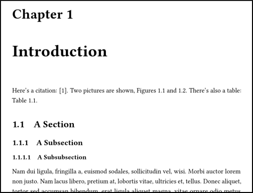

# [NTNU ITK](https://www.ntnu.edu/itk) thesis template
A template for theses at NTNU's Department of Engineering Cybernetics (and other places). It looks like this:

## How to use
Pretty straightforward---just copy everything and replace the contents with your thesis.

The main branch uses biblatex for references. If you have trouble making it work, you can fall back on using natbib, which is in the natbib branch.

* `bib/`: Put your bibliography files here.
    - You should use probably use [Mendeley](https://mendeley.com) or [Zotero](http://zotero.org) or [EndNote](https://endnote.com) or something, so you don't have to write these manually.
* `img/`: Put your graphics here.
* `tex/`: Put your tex source files here. I usually create one file per chapter.
* `config.sty`: Put all your `usepackage` commands and other document configuration stuff here.
* `Thesis.tex`: The main thesis source file, which includes all your chapters, etc.

## Dependencies

* __biber__: The template is by default set up with [biblatex](https://www.sharelatex.com/learn/Bibliography_management_in_LaTeX) to manage your bibliography, using the biber backend. On Linux, you might have to install biber with `sudo apt install biber` or similar. On Windows, at least MikTex includes biber by default. On OS X, I don't know. If you have trouble with biblatex, you can use the natbib branch instead.

## How it's configured

* Page size B5.
* Font size 10.
* All chapters begin on a right hand page.
* Abstracts, lists of figures, etc. may start on a left or right hand page.
* The [Libertine](https://en.wikipedia.org/wiki/Linux_Libertine) font is used for text and math.
* The [Inconsolata](https://en.wikipedia.org/wiki/Inconsolata) font is used for code listings.
